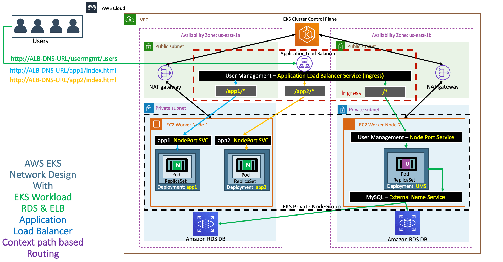

# 📦 User Management Application on Amazon EKS

## 📷 Architecture Diagram




---

This project demonstrates how to deploy a **User Management Microservice** along with two NGINX applications (`App1` and `App2`) on **Amazon EKS (Elastic Kubernetes Service)**. The setup includes RDS MySQL integration, Kubernetes secrets, NodePort services, and ALB Ingress for external access.

## 📁 Project Structure

| File | Description |
|------|-------------|
| `01-MySQL-externalName-Service.yml` | Defines ExternalName service to connect with external RDS MySQL |
| `02-UserManagementMicroservice-Deployment-Service.yml` | Deploys the User Management microservice and its service |
| `03-Kubernetes-Secrets.yml` | Stores MySQL DB password securely as a Kubernetes Secret |
| `04-UserManagement-NodePort-Service.yml` | Exposes the microservice via NodePort |
| `05-Nginx-App1-Deployment-and-NodePortService.yml` | Deploys App1 (NGINX) and its NodePort service |
| `06-Nginx-App2-Deployment-and-NodePortService.yml` | Deploys App2 (NGINX) and its NodePort service |
| `07-ALB-Ingress-Basic.yml` | Configures ALB Ingress Controller with path-based routing |

---

## 🚀 Deployment Guide

### 1. Prerequisites

- Amazon EKS Cluster is already created
- ALB Ingress Controller is installed and configured
- `kubectl` configured to point to your EKS cluster

### 2. Deploy RDS MySQL External Service

```bash
kubectl apply -f 01-MySQL-externalName-Service.yml
```

---

### 3. Create Kubernetes Secret

```bash
kubectl apply -f 03-Kubernetes-Secrets.yml
```

---

### 4. Deploy User Management Microservice

```bash
kubectl apply -f 02-UserManagementMicroservice-Deployment-Service.yml
kubectl apply -f 04-UserManagement-NodePort-Service.yml
```

---

### 5. Deploy NGINX Apps

```bash
kubectl apply -f 05-Nginx-App1-Deployment-and-NodePortService.yml
kubectl apply -f 06-Nginx-App2-Deployment-and-NodePortService.yml
```

---

### 6. Setup Ingress (ALB)

```bash
kubectl apply -f 07-ALB-Ingress-Basic.yml
```

Check external ALB endpoint:

```bash
kubectl get ingress
```

---

## 🔐 Security

- DB credentials are stored as Kubernetes Secrets
- ALB performs health checks on services

---

## ✅ Health Checks

- User Management: `/usermgmt/health-status`
- App1: `/app1/index.html`
- App2: `/app2/index.html`

---

## 📌 Notes

- Ensure RDS is accessible from your EKS nodes
- Use correct healthcheck annotations when combining services under ALB

---

Bạn muốn mình tạo luôn file `.md` không? Hoặc cần chuyển sang tiếng Việt thì cứ nói nhé!